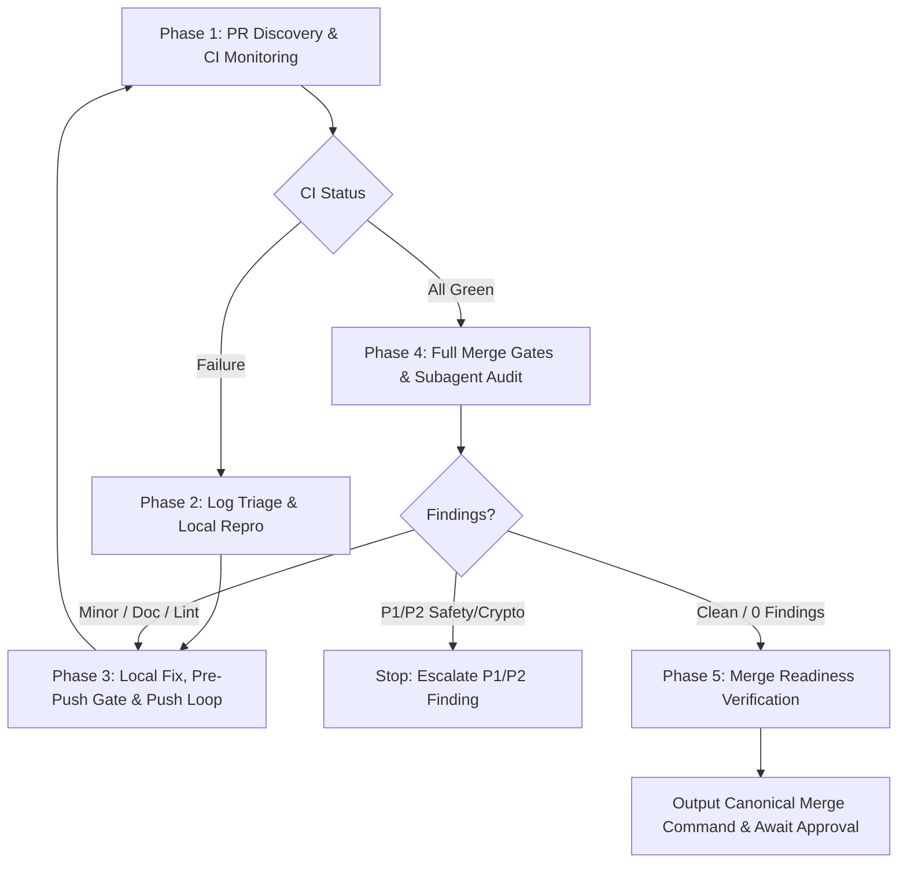

> **Canonical runner-neutral skill.** Read [`AGENTS.md`](../../../AGENTS.md) before acting.
> Project skills are canonical under [`.agents/skills/`](../), and lifecycle/PR policy is
> enforced by the runner-neutral core under [`tools/agent-hooks/`](../../../tools/agent-hooks/).
> Invoke this workflow canonically as `$ci-heal`.

# ci-heal — Post-Push CI Monitoring, Failure Remediation & PR Merge Readiness

This skill orchestrates the post-push CI lifecycle for `tesla-key-esp32`. It continuously monitors
GitHub Actions CI workflows for an open pull request, extracts failed logs upon workflow breakage,
reproduces defects locally, applies fixes to code, tests, or documentation, verifies pre-push gates,
updates gate stamps on the PR, pushes commits to origin, audits full merge gates and review
subagents, and verifies that the PR reaches a completely clean, mergeable state.

> **Authorization and Safety Boundary.** Invoking this skill authorizes scoped local fixes,
> running repository verification scripts, updating PR gate checkboxes, and pushing fix commits
> to the active PR branch up to the iteration limit. It does **not** authorize modifying
> `partitions.csv`, Secure-Boot keys, NVS layouts, or PSA crypto seams. Any P1/P2 security,
> signing, NVS, pairing, partition, or vehicle-safety finding is a stop condition.
> Executing the canonical squash merge requires separate explicit user authorization.

---

## 5-Phase Workflow



---

## Phase 1: PR Discovery & CI Monitoring

1. **Detect PR Context**:
   Determine the target PR number from the current branch or arguments:
   ```bash
   PR=$(gh pr view --json number -q .number)
   BRANCH=$(git rev-parse --abbrev-ref HEAD)
   HEAD_SHA=$(gh pr view "$PR" --json headRefOid -q .headRefOid)
   ```
2. **Watch CI Workflow Status**:
   Monitor running checks until completion:
   ```bash
   gh pr checks "$PR" --watch
   ```
   Or query check status:
   ```bash
   gh pr view "$PR" --json statusCheckRollup
   ```

---

## Phase 2: Failure Analysis & Local Reproduction

If any CI check fails:

1. **Extract Failed Job Logs**:
   Identify the failed run ID and view failure logs:
   ```bash
   gh run view <RUN_ID> --log-failed | tail -60
   ```
2. **Reproduce Locally via Scoped Tests**:
   Run the narrowest matching test script first based on failure origin:
   - **Agent configuration / rules**: `./tools/agent-config/selftest.sh`
   - **Repository linter / syntax**: `./scripts/repo-lint.sh`
   - **Host logic / mock tests**: `./scripts/run-mock-tests.sh` (or `--require-all`)
   - **Tesla BLE integration harness**: `./scripts/test-tesla-ble-harness.sh`
   - **Build contracts / pins / partition**: `./scripts/test-build-contracts.sh`
   - **PR gate matcher**: `./scripts/test-pr-gates.sh`
   - **Sanitizers**: `./scripts/run-sanitizer-tests.sh`
   - **ESP-IDF firmware compilation** (if Docker is present):
     `./scripts/idf-docker.sh idf.py -B build set-target esp32s3 build`

---

## Phase 3: Autonomous Fix, Pre-Push Gates & Push Loop

1. **Apply Scoped Fix**:
   Edit affected code, documentation, or configuration. Ensure fixes stay minimal and adhere to
   the architecture guidelines in [`docs/ARCHITECTURE.md`](../../../docs/ARCHITECTURE.md) and
   memory safety rules in [`AGENTS.md`](../../../AGENTS.md).
2. **Local Re-Verification**:
   Rerun the failing test locally until it passes cleanly, followed by `./scripts/repo-lint.sh`
   and `./scripts/run-mock-tests.sh`.
3. **Commit Changes**:
   Stage only the relevant files:
   ```bash
   git add <files>
   git commit -m "fix(<scope>): resolve CI failure"
   NEW_HEAD=$(git rev-parse HEAD)
   ```
4. **Pre-Push Gate Screen & Stamping**:
   The pre-push hook requires current `$skill-audit` and `$pr-hygiene` records on the PR:
   - Run `$skill-audit` checks: `node tools/agent-config/check.mjs`
   - Run `$pr-hygiene` checks: ensure commit messages and PR text are in English without private identifiers (LAN IPs, MACs, VINs).
   - Stamp the PR gate records before pushing:
     ```bash
     ./scripts/stamp-pr-gates.sh --update-pr "$PR" --head "$NEW_HEAD" \
       --gate skill-audit="tools/agent-config/check.mjs @ $NEW_HEAD" \
       --gate pr-hygiene="clean @ $NEW_HEAD"
     ```
5. **Push Fix Commit**:
   ```bash
   git push origin "$BRANCH"
   ```
6. **Iteration Guard**:
   Increment iteration counter. If iterations exceed the configured limit (default: 3, maximum: 5),
   stop and report failure details to the user to prevent infinite push loops.

---

## Phase 4: Full Merge Gates & Subagent Audit

Once CI checks are completely green for the current commit:

1. **Evaluate Required Gates**:
   - Determine relevant conditional gates:
     - Check if [`docs/FEATURES.md`](../../../docs/FEATURES.md), `AGENTS.md`, `main/`, `test/`, etc., were touched (requires `$feature-docs`).
     - Check if `main/vehicle_*`, `main/ble_client.*`, `patches/tesla-ble/`, etc., were touched (requires `$vehicle-command-audit`).
2. **Audit PR Gates Locally**:
   - Run `$skill-audit`: `./tools/agent-config/selftest.sh` and `node ./tools/agent-config/check.mjs`.
   - Run `$pr-hygiene`: verify English content and absence of sensitive tokens.
   - Run `$project-review`: verify system-wide coherence and contracts.
   - If relevant, run `$feature-docs` to ensure [`docs/FEATURES.md`](../../../docs/FEATURES.md) reflects all changes.
   - If relevant, run `$vehicle-command-audit` (`./scripts/test-tesla-ble-harness.sh`).
3. **Consult Specialized Review Subagents**:
   Engage or verify against the four canonical review roles:
   - `agent_config_reviewer`
   - `doc_drift_checker`
   - `heap_safety_reviewer`
   - `multi_target_build_reviewer`
4. **Handle Findings**:
   - **P1/P2 Security / Safety / Crypto finding**: STOP immediately. Escalate to the user.
   - **Minor / Doc / Style finding**: Apply local correction and loop through Phase 3.
   - **Clean / 0 Findings**: Proceed to stamp all merge gates:
     ```bash
     CURRENT_HEAD=$(git rev-parse HEAD)
     ./scripts/stamp-pr-gates.sh --update-pr "$PR" --head "$CURRENT_HEAD" \
       --gate skill-audit="tools/agent-config/check.mjs @ $CURRENT_HEAD" \
       --gate pr-hygiene="clean @ $CURRENT_HEAD" \
       --gate project-review="0 findings @ $CURRENT_HEAD"
     ```
     (Include `--gate feature-docs=...` and `--gate vehicle-command-audit=...` if relevant.)

---

## Phase 5: Merge Readiness Verification

1. **Check Mergeability**:
   Verify GitHub reports the PR as mergeable:
   ```bash
   gh pr view "$PR" --json mergeable,mergeStateStatus,reviewDecision
   ```
2. **Notify User & Canonical Merge Command**:
   Confirm that CI is green, all gates are stamped, and no findings remain. Present the exact,
   single canonical squash merge command:
   ```bash
   gh --repo github.com/0Bu/tesla-key-esp32 pr merge <PR> --match-head-commit <FULL_40_HEX_HEAD_SHA> --squash
   ```
3. **Execution**:
   Ask the user for explicit confirmation before executing the merge, or perform the merge only if
   explicitly authorized beforehand via `--auto-merge`.

---

## Phase 6: Self-Evaluation, Scorecard & Self-Optimization

At the conclusion of every execution (successful merge readiness or early stop):

1. **Calculate Run Metrics**:
   - **Iterations & Duration**: Remediations performed vs limit ($N$/$M$) and elapsed time.
   - **Triage Accuracy & Root Cause**: Category of failures detected (`repo-lint`, `agent-config`, `mock-tests`, `pr-gates`, `contracts`, `sanitizer`, `compiler`).
   - **Fix Minimality**: Total lines added/deleted and files touched to resolve the defect.
   - **Efficiency Index**: Rating score based on resolution speed, minimal changes, and zero post-fix reviewer findings.
2. **Present Scorecard**:
   - Output a structured scorecard summarizing performance, root causes, and optimizations.
3. **Persist Knowledge & Adaptive Heuristics (`.tmp/ci-heal-cache.json`)**:
   - Save error signatures and increment category frequencies in `.tmp/ci-heal-cache.json`.
   - **Adaptive Pre-Flight Prioritization**: In future runs, `scripts/ci-heal.sh` consults `.tmp/ci-heal-cache.json` and automatically runs high-frequency failure checks first during local pre-flight, intercepting known regression patterns before pushing to GitHub CI.

