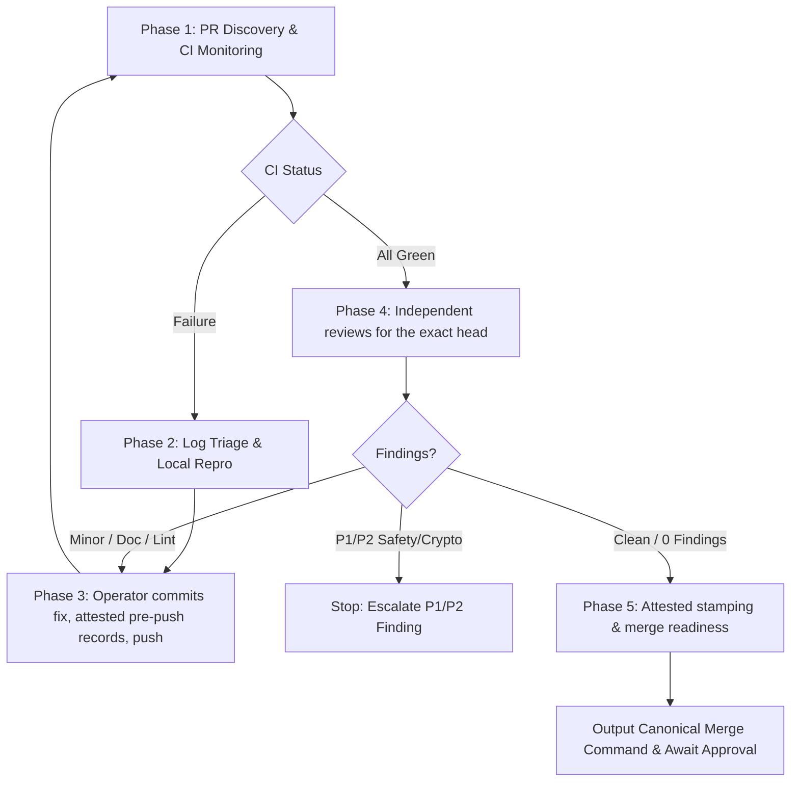

> **Canonical runner-neutral skill.** Read [`AGENTS.md`](../../../AGENTS.md) before acting.
> Project skills are canonical under [`.agents/skills/`](../), and lifecycle/PR policy is
> enforced by the runner-neutral core under [`tools/agent-hooks/`](../../../tools/agent-hooks/).
> Invoke this workflow canonically as `$ci-heal`.

# ci-heal — Post-Push CI Monitoring, Failure Reproduction & Merge-Readiness Gate

This skill orchestrates the post-push CI lifecycle for `tesla-key-esp32`. It monitors GitHub
Actions for an open pull request, extracts failed logs, reproduces the failure locally with the
narrowest matching repository script, pushes a fix commit that the operator already made, and
verifies that the PR reaches a mergeable state with current gate records.

> **Authorization and Safety Boundary.** Invoking this skill authorizes running the repository
> verification scripts, editing the PR body's gate records **from explicit attestations**, and
> pushing an already-committed fix to the active PR branch up to the iteration limit. It does
> **not** authorize authoring commits, running or simulating a review, modifying `partitions.csv`,
> Secure-Boot keys, NVS layouts, or PSA crypto seams. Any P1/P2 security, signing, NVS, pairing,
> partition, or vehicle-safety finding is a stop condition. Executing the canonical squash merge
> requires separate explicit user authorization (`--auto-merge` is that authorization, given
> per invocation).

## What the script guarantees (and what it refuses)

`scripts/ci-heal.sh` is deliberately conservative; its self-test drives the real flow with stubbed
`git`/`gh` and pins every refusal below.

- **It never commits.** A fix must already be committed by the operator (English message, no
  private identifiers). An uncommitted working tree stops the run. ci-heal only pushes when local
  `HEAD` descends from the PR head, and never rewrites history.
- **It never invents a review.** A gate record is written only from `--attest <gate>=<evidence>`,
  where the evidence names the independent review that was actually completed for the exact head
  being stamped (for example a report path and its finding count). A syntax or configuration
  check such as `node tools/agent-config/check.mjs` is **not** a `$skill-audit`, and a green CI
  run is **not** a `$project-review`. Without an attestation the run ends with exit code 3 and the
  exact `--attest` flags that are missing.
- **Readiness is about one commit.** Stamping, `READY FOR MERGE` and `--auto-merge` all require
  green CI on the PR head, local `HEAD` equal to that head, a clean working tree, the PR reporting
  `MERGEABLE`, and an unchanged head immediately before the body edit. Any mismatch stops the run
  before anything is stamped.
- **Relevance matches the merge hook.** The gates a PR needs come from the same GitHub-side
  changed-file list and the same shared predicates (`gate_feature_docs_relevant`,
  `gate_vehicle_command_relevant`, `gate_is_renovate_maintenance`) as
  `tools/agent-hooks/require-pr-gates.sh`. If that list cannot be read, nothing is stamped.
- **It fails closed on its own inputs.** A missing or incomplete `tools/agent-hooks/pr-gate-lib.sh`,
  an unknown gate name, a non-numeric PR number or a non-40-hex head is a hard stop. The merge
  runs as a direct `gh` invocation with validated arguments, never through `eval`.

Exit codes: `0` ready or diagnosed, `1` blocked or failed, `2` usage/configuration, `3` gate
records withheld.

---

## 5-Phase Workflow



---

## Phase 1: PR Discovery & CI Monitoring

1. **Detect PR Context**:
   ```bash
   PR=$(gh pr view --json number -q .number)
   BRANCH=$(git rev-parse --abbrev-ref HEAD)
   HEAD_SHA=$(gh pr view "$PR" --json headRefOid -q .headRefOid)
   ```
   The current branch must be the PR's head branch; the script refuses otherwise.
2. **Watch CI Workflow Status**:
   ```bash
   gh pr checks "$PR" --watch
   ```

---

## Phase 2: Failure Analysis & Local Reproduction

If any CI check fails, `ci-heal.sh` prints the failed job logs and runs the narrowest matching
local script first:

- **Agent configuration / rules**: `./tools/agent-config/selftest.sh`
- **Repository linter / syntax**: `./scripts/repo-lint.sh`
- **Host logic / mock tests**: `./scripts/run-mock-tests.sh` (or `--require-all`)
- **Tesla BLE integration harness**: `./scripts/test-tesla-ble-harness.sh`
- **Build contracts / pins / partition**: `./scripts/test-build-contracts.sh`
- **PR gate matcher**: `./scripts/test-pr-gates.sh`
- **Sanitizers**: `./scripts/run-sanitizer-tests.sh`
- **ESP-IDF firmware compilation** (if Docker is present):
  `./scripts/idf-docker.sh idf.py -B build set-target esp32s3 build`

A failure that cannot be identified from the check rollup (pending, cancelled, API error) is not
treated as fixable; the script stops and points at `gh pr checks`.

---

## Phase 3: Fix, Pre-Push Records & Push

1. **Apply a scoped fix and commit it yourself.** Keep the fix minimal and within
   [`docs/ARCHITECTURE.md`](../../../docs/ARCHITECTURE.md) and [`AGENTS.md`](../../../AGENTS.md).
   Do not use `git add -A`; stage only the files the fix touches.
2. **Complete the pre-push reviews for the new commit.** The push hook requires current
   `$skill-audit` and `$pr-hygiene` records for the exact commit being pushed. Run both reviews
   (read-only) against that commit.
3. **Re-run ci-heal with the attestations:**
   ```bash
   scripts/ci-heal.sh --pr "$PR" \
     --attest skill-audit="<report reference, 0 findings>" \
     --attest pr-hygiene="<report reference, clean>"
   ```
   ci-heal stamps both records for the local `HEAD`, pushes the branch, waits until GitHub reports
   that commit as the PR head, and resumes monitoring. A later commit stales every record and needs
   fresh attestations.
4. **Iteration Guard.** Iterations beyond the limit (default 3, maximum 5) stop the run.

---

## Phase 4: Independent Reviews for the Exact Head

Once CI is green for the current commit, complete the reviews that produce the gate records:

- `$skill-audit` — `./tools/agent-config/selftest.sh` supports it but does not replace it.
- `$pr-hygiene` — English content and no private identifiers in commits, PR text and touched docs.
- `$project-review` — system-wide coherence and contracts.
- `$feature-docs` — when the feature catalog surface changed (`gate_feature_docs_relevant`).
- `$vehicle-command-audit` — when vehicle-command/BLE paths changed
  (`gate_vehicle_command_relevant`; `./scripts/test-tesla-ble-harness.sh` supports it).

The four reviewer roles (`agent_config_reviewer`, `doc_drift_checker`, `heap_safety_reviewer`,
`multi_target_build_reviewer`) may be consulted. A P1/P2 security, safety, crypto, signing, NVS,
pairing or partition finding is a stop condition: escalate to the user.

---

## Phase 5: Attested Stamping & Merge Readiness

```bash
scripts/ci-heal.sh --pr "$PR" \
  --attest skill-audit="<evidence>" --attest project-review="<evidence>" \
  --attest pr-hygiene="<evidence>"    # plus feature-docs / vehicle-command-audit when relevant
```

With green CI, `MERGEABLE`, local `HEAD` equal to the PR head and every needed gate attested,
ci-heal stamps the records and prints the exact, single canonical squash merge command:

```bash
gh --repo github.com/0Bu/tesla-key-esp32 pr merge <PR> --match-head-commit <FULL_40_HEX_HEAD_SHA> --squash
```

Ask the user for explicit confirmation before executing the merge, or pass `--auto-merge` only when
the user has authorized the merge for this exact PR. `--dry-run` diagnoses without stamping,
pushing or merging and is incompatible with `--auto-merge`.

---

## Phase 6: Self-Evaluation, Scorecard & Self-Optimization

At the conclusion of every execution (successful merge readiness or early stop):

1. **Calculate Run Metrics**: iterations vs limit, duration, the failure category (`repo-lint`,
   `agent-config`, `mock-tests`, `pr-gates`, `build-contracts`, `sanitizers`, `compiler`), and the
   fix footprint.
2. **Present Scorecard** summarizing the outcome and root cause.
3. **Persist Knowledge (`.tmp/ci-heal-cache.json`)**: category frequencies are stored locally and
   used to run high-frequency checks first in later pre-flights. The cache is untracked.
