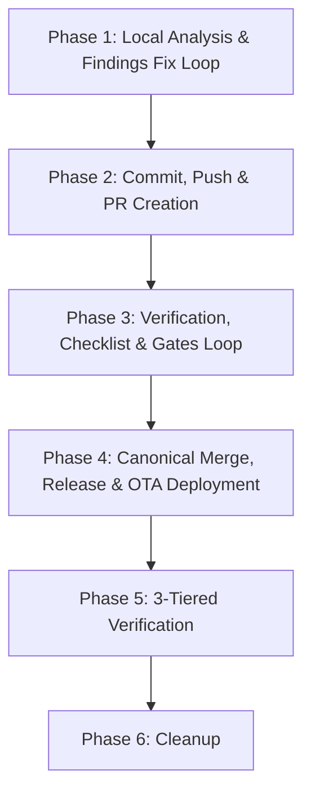

> **Canonical runner-neutral skill.** Read [`AGENTS.md`](../../../AGENTS.md) before acting.
> Project skills are canonical under [`.agents/skills/`](../), and lifecycle/PR policy is
> enforced by the runner-neutral core under [`tools/agent-hooks/`](../../../tools/agent-hooks/).
> Invoke this workflow canonically as `$deploy`.

# deploy — End-to-End Release & Delivery Lifecycle

This skill orchestrates the complete, fail-closed delivery pipeline for `tesla-key-esp32`. It takes
working tree changes through local verification, PR creation, CI monitoring, canonical squash merge,
post-merge GitHub Release verification, OTA update on the bench/target board (`tesla-key-esp32.local`),
multi-tier testing (targeted, comprehensive, and cluster evcc E2E), and branch cleanup.

> **Authorization boundary.** Invoking this skill requires explicit user authorization for the entire
> delivery lifecycle: local fix loops, commit, push, PR creation, canonical squash merge, the
> firmware-release/signing publication side effect of the main build, OTA deployment to the identified
> device, and post-deployment live verification. If unrecoverable errors occur at any gate, stop and
> report immediately (fail-closed).

---

## Overview: The 6 Delivery Phases



---

## Phase 1: Local Analysis & Findings Fix Loop

Before committing or pushing, verify workspace cleanliness, code style, unit tests, and contracts locally:

1. **Whitespace & Conflict Marker Check**:
   ```bash
   git diff --check
   ```
2. **Offline Repository Linter**:
   ```bash
   ./scripts/repo-lint.sh
   ```
3. **Host Mock & Unit Test Suite**:
   ```bash
   ./scripts/run-mock-tests.sh
   ```
4. **Build Contracts & Partition Checks**:
   ```bash
   ./scripts/test-build-contracts.sh
   ```
5. **PR Gate Canaries & Agent Configuration Selftest**:
   ```bash
   ./scripts/test-pr-gates.sh
   ./tools/agent-config/selftest.sh
   ```
6. **Firmware Compile Check (Conditional)**:
   If firmware files under `main/` were modified and Docker is available:
   ```bash
   ./scripts/idf-docker.sh idf.py -B build set-target esp32s3 build
   ```

**Fix Loop**: If any check fails, analyze the root cause, apply the fix to code or tests, and re-run Phase 1 until all checks pass cleanly.

---

## Phase 2: Commit, Push & PR Creation

1. **Pre-PR Screen (`$skill-audit` & `$pr-hygiene`)**:
   - Run `$skill-audit` locally to ensure all canonical skills and subagent manifests match repository conventions.
   - Run `$pr-hygiene` screen:
     - Ensure all commit messages, PR titles, and PR descriptions are strictly written in **English**.
     - Verify that no private IP addresses (use RFC 5737/3849 documentation addresses if needed), real MAC addresses, or real vehicle VINs are committed.
2. **Commit Changes**:
   Stage only the relevant files and commit using conventional commit format:
   ```bash
   git add <modified-files>
   git commit -m "feat(<scope>): <concise description in English>"
   ```
3. **Push Feature Branch**:
   ```bash
   BRANCH=$(git rev-parse --abbrev-ref HEAD)
   git push -u origin "$BRANCH"
   ```
4. **Create PR with Canonical Gate Checkboxes**:
   Determine the current HEAD SHA via `HEAD_SHA=$(git rev-parse HEAD)`.
   Generate the PR body including the 5 canonical gate checkboxes. Note that `$skill-audit` and `$pr-hygiene` must actually be executed and pass cleanly for the current commit prior to PR creation (do not pre-tick without running):
   ```markdown
   ## Summary
   <Concise description of changes in English>

   ## PR Gates
   - [x] `$skill-audit` clean — PR create/push gate @ <FULL_40_HEX_HEAD_SHA>
   - [ ] `$project-review` clean — merge gate @ <full-40-hex-sha>
   - [x] `$pr-hygiene` clean — content gate @ <FULL_40_HEX_HEAD_SHA>
   - [ ] `$feature-docs` synced — merge gate @ <full-40-hex-sha>
   - [ ] `$vehicle-command-audit` clean — merge gate @ <full-40-hex-sha>
   ```
   Submit the pull request:
   ```bash
   gh pr create --title "<Title in English>" --body-file <PATH_TO_BODY>
   PR=$(gh pr view --json number -q .number)
   ```

---

## Phase 3: Verification, Checklist & Gates Loop

1. **Monitor PR Checks on CI**:
   ```bash
   gh pr checks "$PR" --watch
   ```
2. **Audit & Stamp PR Gates**:
   Run the respective audit skills (`$project-review`, `$feature-docs`, `$vehicle-command-audit`) against the current HEAD.
   Once each audit passes cleanly, stamp the verified gates on the PR using confirmation tokens naming the audit results and SHA:
   ```bash
   HEAD=$(git rev-parse HEAD)
   ./scripts/stamp-pr-gates.sh --update-pr "$PR" \
     --gate skill-audit="tools/agent-config/check.mjs @ $HEAD" \
     --gate pr-hygiene="clean @ $HEAD" \
     --gate project-review="0 findings @ $HEAD" \
     --gate feature-docs="docs/FEATURES.md @ $HEAD" \
     --gate vehicle-command-audit="scripts/test-tesla-ble-harness.sh @ $HEAD"
   ```
   (Only include conditional gates `--gate feature-docs=...` or `--gate vehicle-command-audit=...` if relevant to the changed paths.)
3. **Fix & Re-Check Loop**:
   - If any CI job fails, inspect the failure logs:
     ```bash
     gh run view <RUN_ID> --log-failed | tail -40
     ```
   - Implement the necessary fix locally.
   - Re-run all Phase 1 checks locally.
   - Commit the fix locally:
     ```bash
     git add <modified-files>
     git commit -m "fix: resolve CI failure"
     NEW_HEAD=$(git rev-parse HEAD)
     ```
   - Re-run `$skill-audit` and `$pr-hygiene` against the new commit before updating PR gates for the push:
     Run `$skill-audit` and `$pr-hygiene` locally to verify they pass cleanly (do not stamp without running). The pre-push hook requires current `$skill-audit` and `$pr-hygiene` records on the PR before allowing a push to an open PR. Stamp them first:
     ```bash
     ./scripts/stamp-pr-gates.sh --update-pr "$PR" --head "$NEW_HEAD" \
       --gate skill-audit="tools/agent-config/check.mjs @ $NEW_HEAD" \
       --gate pr-hygiene="clean @ $NEW_HEAD"
     ```
   - Push the fix:
     ```bash
     git push origin "$BRANCH"
     ```
   - Re-audit and stamp the merge gates for the new HEAD commit:
     Re-run the relevant audit skills (`$skill-audit`, `$pr-hygiene`, `$project-review`, plus any applicable conditional audit skills `$feature-docs` or `$vehicle-command-audit`) against `$NEW_HEAD`. Only after each audit passes cleanly, re-stamp all gates on the PR:
     ```bash
     ./scripts/stamp-pr-gates.sh --update-pr "$PR" --head "$NEW_HEAD" \
       --gate skill-audit="tools/agent-config/check.mjs @ $NEW_HEAD" \
       --gate pr-hygiene="clean @ $NEW_HEAD" \
       --gate project-review="0 findings @ $NEW_HEAD"
     ```
     (Include conditional `--gate feature-docs=...` or `--gate vehicle-command-audit=...` if relevant.)
   - Repeat until all PR checks are green and all gates are satisfied.

---

## Phase 4: Canonical Merge, Release & OTA Deployment

### 1. Canonical Squash Merge
Once all PR checks pass and gates are stamped, obtain and verify the PR head SHA:
```bash
PR_HEAD=$(gh pr view "$PR" --json headRefOid -q .headRefOid)
[[ "$PR_HEAD" =~ ^[0-9a-f]{40}$ ]] || { echo "REFUSING: invalid PR head SHA" >&2; exit 1; }
```

Execute the single standalone canonical squash merge command using literal `<numeric_pr>` and `<full_40_hex_head_sha>` (never compounded, chained, or using shell variables):
```bash
gh --repo github.com/0Bu/tesla-key-esp32 pr merge <numeric_pr> --match-head-commit <full_40_hex_head_sha> --squash
```

Then retrieve the merge commit SHA:
```bash
MERGE_SHA=$(gh pr view <numeric_pr> --json mergeCommit -q .mergeCommit.oid)
[[ "$MERGE_SHA" =~ ^[0-9a-f]{40}$ ]] || { echo "REFUSING: invalid merge commit SHA" >&2; exit 1; }
```

### 2. Monitor Post-Merge Build & Release on Main
Watch the CI build run triggered by the merge commit on `main`:
```bash
set -euo pipefail
RUN_IDS=$(gh run list --workflow build --branch main --commit "$MERGE_SHA" --event push --limit 20 \
  --json databaseId,headSha,event \
  --jq ".[] | select(.headSha == \"$MERGE_SHA\" and .event == \"push\") | .databaseId")
[ "$(printf '%s\n' "$RUN_IDS" | awk 'NF {n++} END {print n+0}')" -eq 1 ] || {
  echo "REFUSING: expected exactly one build run for merge SHA $MERGE_SHA" >&2; exit 1;
}
MAIN_RUN_ID=$(printf '%s\n' "$RUN_IDS" | awk 'NF {print}')
gh run watch "$MAIN_RUN_ID" --exit-status
```

If the changes are firmware-relevant, the CI run tags and publishes a new GitHub Release. Retrieve the published version:
```bash
LATEST_TAG=$(gh release view --json tagName -q .tagName)
RELEASE_VERSION="${LATEST_TAG#v}"
echo "Published Release: $LATEST_TAG (version: $RELEASE_VERSION)"
```

### 3. OTA Update on Target Board
Target device address defaults to `tesla-key-esp32.local` (with optional `DEVICE_IP` override, e.g. `192.0.2.100`):
```bash
set -euo pipefail
TARGET_HOST="${DEVICE_IP:-tesla-key-esp32.local}"

# Step A: Initiate background OTA check
CHECK_JSON=$(curl --connect-timeout 5 --max-time 10 -fsS \
  "http://$TARGET_HOST/ota/check?ms=$(date +%s000)")
printf '%s' "$CHECK_JSON" | jq -e '.started == true' >/dev/null || {
  echo "REFUSING: OTA check did not start" >&2; exit 1;
}

# Step B: Poll /ota/status until ready with matching release version
OTA_READY=0
CHECK_DEADLINE=$((SECONDS + 60))
while (( SECONDS < CHECK_DEADLINE )); do
  OTA_JSON=$(curl --connect-timeout 5 --max-time 10 -fsS \
    "http://$TARGET_HOST/ota/status") || { sleep 2; continue; }
  OTA_STATE=$(printf '%s' "$OTA_JSON" | jq -r .state)
  case "$OTA_STATE" in
    checking) sleep 2; continue ;;
    error)
      echo "REFUSING: OTA check failed: $(printf '%s' "$OTA_JSON" | jq -r .message)" >&2
      exit 1 ;;
    idle)
      printf '%s' "$OTA_JSON" | jq -e --arg v "$RELEASE_VERSION" \
        '.update_available == true and .available == $v' >/dev/null || {
        echo "REFUSING: OTA manifest version does not match release $RELEASE_VERSION" >&2
        exit 1
      }
      OTA_READY=1
      break ;;
    *) echo "REFUSING: unexpected OTA state $OTA_STATE" >&2; exit 1 ;;
  esac
done
[ "$OTA_READY" -eq 1 ] || { echo "REFUSING: OTA check timed out" >&2; exit 1; }

# Step C: Trigger OTA update
UPDATE_JSON=$(curl --connect-timeout 5 --max-time 10 -fsS -X POST \
  "http://$TARGET_HOST/ota/update")
printf '%s' "$UPDATE_JSON" | jq -e '.result == true' >/dev/null || {
  echo "REFUSING: OTA update failed to start" >&2; exit 1;
}

# Step D: Wait for reboot and verify new active version
VERIFIED=0
UPDATE_DEADLINE=$((SECONDS + 600))
while (( SECONDS < UPDATE_DEADLINE )); do
  if STATUS_JSON=$(curl --connect-timeout 3 --max-time 5 -fsS "http://$TARGET_HOST/status" 2>/dev/null); then
    if printf '%s' "$STATUS_JSON" | jq -e --arg v "$RELEASE_VERSION" '.version == $v' >/dev/null; then
      VERIFIED=1
      break
    fi
  fi
  sleep 3
done
[ "$VERIFIED" -eq 1 ] || { echo "DEPLOYMENT INCOMPLETE: device did not boot $RELEASE_VERSION" >&2; exit 1; }

# Step E: 90-100s Rollback Probation Verification
PROBATION_BASELINE_UPTIME=$(printf '%s' "$STATUS_JSON" | jq -er '.sys.uptime_s | floor')
PROBATION_START=$SECONDS
PROBATION_DEADLINE=$((SECONDS + 180))
PROBATION_OK=0
while (( SECONDS < PROBATION_DEADLINE )); do
  sleep 3
  CURRENT_STATUS=$(curl --connect-timeout 3 --max-time 5 -fsS "http://$TARGET_HOST/status") || continue
  CUR_UPTIME=$(printf '%s' "$CURRENT_STATUS" | jq -er '.sys.uptime_s | floor')
  if (( CUR_UPTIME < PROBATION_BASELINE_UPTIME )); then
    echo "DEPLOYMENT INCOMPLETE: device rebooted during OTA probation" >&2
    exit 1
  fi
  ELAPSED=$((SECONDS - PROBATION_START))
  if (( ELAPSED >= 100 && (CUR_UPTIME - PROBATION_BASELINE_UPTIME) >= 100 )); then
    PROBATION_OK=1
    break
  fi
done
[ "$PROBATION_OK" -eq 1 ] || { echo "DEPLOYMENT INCOMPLETE: probation failed" >&2; exit 1; }

# Step F: Confirm rollback cancellation via /diag?redact=1
OTA_DIAG=$(curl --connect-timeout 3 --max-time 5 -fsS "http://$TARGET_HOST/diag?redact=1")
printf '%s' "$OTA_DIAG" | grep -F 'OTA image healthy after ' \
  | grep -F 'marked valid (rollback cancelled' >/dev/null || {
  echo "DEPLOYMENT INCOMPLETE: firmware did not confirm rollback cancellation" >&2
  exit 1
}
echo "OTA update successfully deployed and verified on $TARGET_HOST."
```

---

## Phase 5: 3-Tiered Verification

### 5a. Test of the Latest Implementation (Targeted Verification)
Run tests tailored specifically to the code changed in the PR:
- If pure logic in `main/logic/` changed: execute the matching mock tests in `test/test_logic.cpp`.
- If an HTTP or REST API endpoint changed: perform targeted passive GET calls to verify the response schema.
- If MQTT or display changed: verify MQTT topic publications or run `display-preview`.

### 5b. Comprehensive Health & Diagnostic Test
Check overall device stability and telemetry health:
```bash
curl -fsS "http://$TARGET_HOST/status" | jq '{version, paired, connected, heap: .sys.free_heap, min_heap: .sys.min_free_heap, uptime: .sys.uptime_s}'
curl -fsS "http://$TARGET_HOST/api/proxy/1/version" | jq .
curl -fsS "http://$TARGET_HOST/diag?redact=1" | grep -iE 'error|warn|fail|panic' || true
```
Query VictoriaLogs (via `mcp-logs` or HTTP) for the target device over the last 15 minutes:
- Verify **zero** crash dumps, panics, or FreeRTOS task watchdog warnings.
- Verify heap stability (largest free contiguous block remains healthy).

### 5c. End-to-End evcc Verification
Execute the canonical repository E2E test script against the cluster evcc pod:
```bash
bash scripts/e2e_evcc.sh
```
This verifies:
1. Passive `/status` and `/api/proxy/1/version` reads from inside the cluster evcc pod.
2. 15x `vehicle_data` burst test with **0 timeouts**.
3. Absence of Tesla/proxy connection errors in recent evcc pod logs.

---

## Phase 6: Cleanup

Once deployment and all three tiers of verification succeed:

1. **Switch to main and sync**:
   ```bash
   git checkout main
   git pull origin main
   ```
2. **Delete Local Feature Branch**:
   ```bash
   git branch -d "$BRANCH"
   ```
3. **Delete Remote Feature Branch**:
   ```bash
   git push origin --delete "$BRANCH" || true
   ```
4. **Clean Workspace Artifacts**:
   Remove any temporary test files, build staging directories (`_site/`, `_signed/`, `dist/`), or diagnostic captures.
